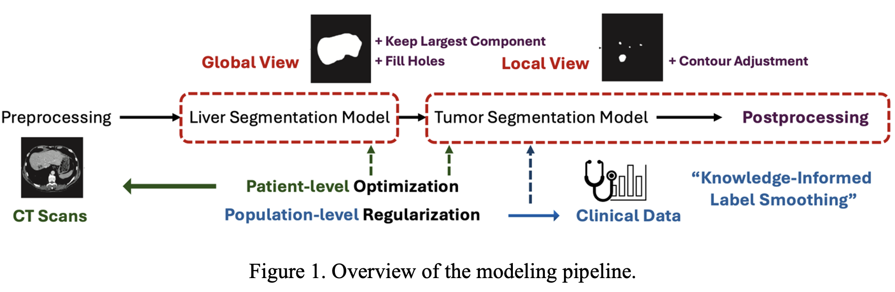
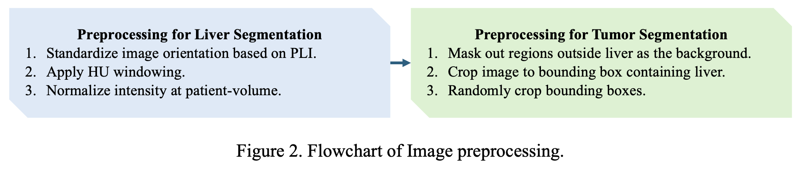
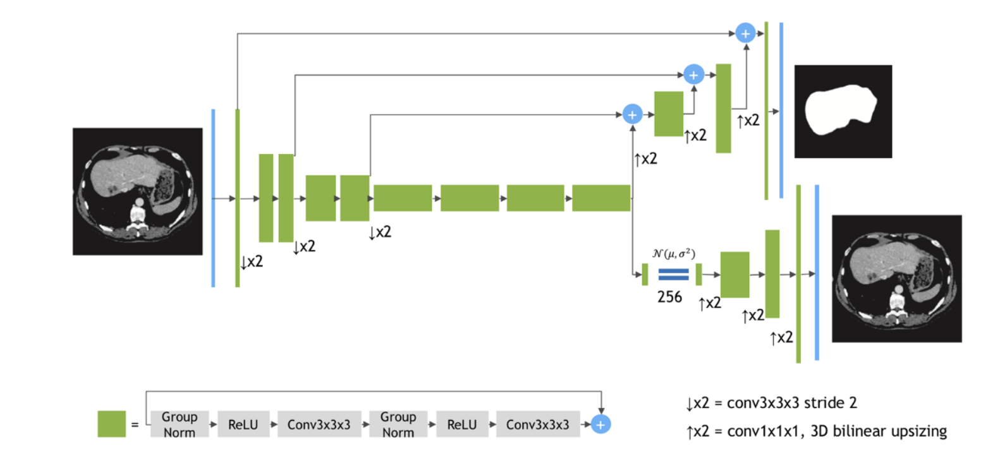
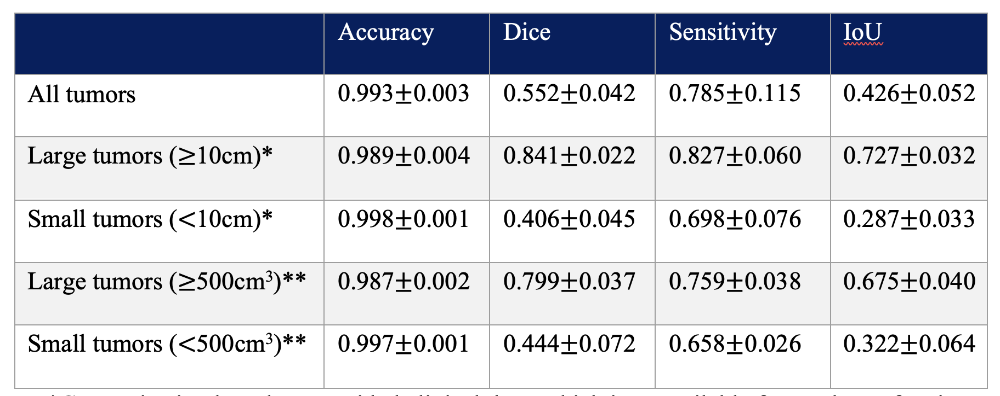
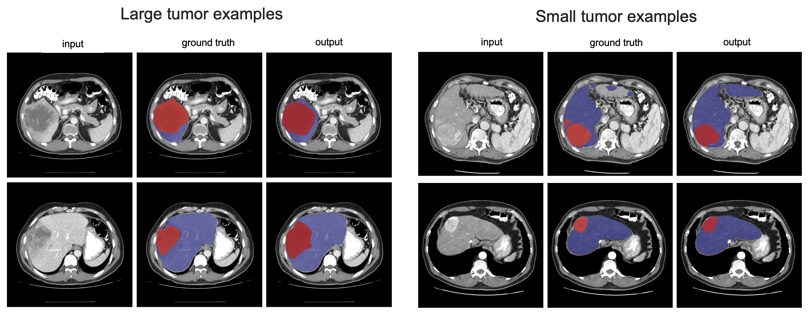

# Deep Learning Model for Liver Tumor Segmentation

Deep learning algorithms has showed promise for producing automat-ed liver and tumor segmentation. While most algorithms achieved excellent per-formance for liver segmentation (0.95 dice score), how to improve the perfor-mance on liver tumor segmentation is still an active area of research (0.65 dice score). 

This work tried several innovative techniques attempting to improve liver tumor segmentation, including: a 

* Global and Local Segmentation Pipeline: We design a sequential pipeline that starts with a global-view liver segmentation model followed by a localview tumor segmentation model. We show that this two-step approach is more flexible than a multi-class approach, allowing preprocessing, training, and post-processing to be optimized for each segmentation task.

* Weak Supervision Incorporation from Clinical Data: Leveraging clinical data, we derive an indicator of tumor severity at the population level. This indicator serves to weakly supervise our tumor segmentation model, which is trained on patient-specific CT scans. By integrating this population-level insight, we regularize the model's learning process, effectively minimizing the risk of overfitting.

* Active Tumor ContoAur Adjustment: We employ a morphological algorithm to refine the segmented tumor boundaries in the post-processing stage, improving the segmentation results for tumors with imprecise margins.]

## Data

We utilized the HCC-TACE-Seg dataset that is publicly available from the Cancer
Imaging Archive (TCIA). This dataset contains pre-procedural CT scans of liver tumors from 98 patients along with corresponding segmentation labels for five classes of objects (normal region, liver, tumor mass, portal vein, and abdominal aorta). Each CT scan has spatial dimensions 512 x 512 x N, where the number of slices N varies by patient. Additionally, a clinical data file containing demographics, related medical history and diagnosis is provided in HCC-TACE-Seg.

## Data Preprocessing

## Backbone Model

We used the SegResNetVAE as the backbone model. This model is built upon an asymmetrical encoderdecoder
based Convolutional Neural Networks (CNNs) architecture. It features an encoder designed for comprehensive image feature extraction and a compact decoder to reconstruct segmentation masks. To augment this structure, an additional variational auto-encoder (VAE) branch is integrated at the encoder's endpoint. The architecture is shown in figure below.

## Results

Using three replications of randomly sampled 80% of patients as training and 20% as test, our model achieved the following test performance on the dataset: 

Some examples of small vs large tumor segmentation outputs are shown below:

