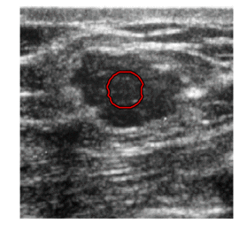

# Deep Learning Model for Liver Tumor Segmentation

Deep learning algorithms has showed promise for producing automat-ed liver and tumor segmentation. While most algorithms achieved excellent per-formance for liver segmentation (>0.95 dice score), how to improve the perfor-mance on liver tumor segmentation is still an active area of research. 

This work tried several innovative techniques attempting to improve liver tumor segmentation, including:  

* **A Knowledge-Informed Label Smoothing Technique**: We extract knowledge from clinical data to derive a high-level clinical indicator of tumor size. This indicator is then used to smoothen the segmentation labels during model training, allowing the model to fit clinical knowledge-informed, denoised labels. By softening the segmentation labels, the technique mitigates overfitting and prevents the model from being overly influenced by inherent variabilities in imaging contrast and lesion characteristics. The proposed knowledge-informed label smoothing has demonstrated improvements in predictive performance.
* **A Global and Local-view Segmentation Framework**: We propose a sequential framework that begins with a global-view liver segmentation model, followed by a local-view tumor segmentation model. This two-step approach offers greater flexibility compared to traditional multi-class methods, as it enables the optimization of preprocessing, training, and post-processing for each segmentation task. 
* **Customized pre- and post-processing for liver and tumor segmentation**: We designed specialized pre-processing pipelines to enhance the visibility of livers and tumors. In the post-processing stage, we employ an **active contour** algorithm to refine the segmented tumor boundaries, improving the segmentation results for tumors with imprecise margins. 

## Data

We utilized the HCC-TACE-Seg dataset that is publicly available from the Cancer
Imaging Archive (TCIA). This dataset contains pre-procedural CT scans of liver tumors from 98 patients along with corresponding segmentation labels for five classes of objects (normal region, liver, tumor mass, portal vein, and abdominal aorta). Each CT scan has spatial dimensions 512 x 512 x N, where the number of slices N varies by patient. Additionally, a clinical data file containing demographics, related medical history and diagnosis is provided in HCC-TACE-Seg.

## Knowledge-informed Label Smoothing
We introduced a novel label smoothing technique that leverages clinical knowledge-informed, denoised labels about the tumor segmentation to regularize the learning process and mitigate overfitting. The clinical knowledge related to tumor severity is extracted from clinical data through a regression model, which learns patterns linking clinical variables to tumor size across all patients. This knowledge is then converted into a high-level indicator of Tumor-to-Liver Volume Ratio (TLVR) that is used as a weak label during model training. 

The weak label generation process is akin to label smoothing, a regularization technique in deep learning commonly used to cope with label noise. This approach has been empirically shown to improve both predictive performance and model calibration. If domain knowledge about the distribution of output labels is available, incorporating this knowledge into the label smoothing process can further boost model performance. Thus, we distilled the clinical knowledge from clinical data to generate smooth weak labels of tumor size. 

## Global-Local Pipeline

To address the difficulty of tumor segmentation, we adopt a two-step strategy to break down the original task of “segmenting liver tumors from abdomen” into two simpler sub-tasks: (i) “segmenting liver from abdomen” and (ii) “segmenting tumor from liver”. This design assumes that the two-subtasks involve distinct modeling challenges and require different informative signals. In the first sub-task, a segmentation model focuses on delineating the liver from other structures within the whole abdominal CT image (global view). This task requires comprehensive understanding of anatomical structures. Since the location and shape of livers compared to other organs is generally consistent across patients, existing deep learning models have solved this problem with high accuracy.  Utilizing the liver masks obtained from the first task, the CT image is cropped to a liver-focused bounding box from which a second model segments the tumor (local view). The model's focus narrows to the liver area, demanding the capture of precise, fine-grained feature information to distinguish between healthy and tumorous tissues within the organ. 

## Customized pre- and post-processing for liver tumor segmentation

We designed preprocessing steps to optimize the input data for both liver and tumor segmentation models, addressing challenges such as image heterogeneity and enhancing the focus on relevant anatomical structures 

We employed an active contour algorithm that is capable of detecting smooth boundaries without relying on image gradients. This method is adept at capturing the irregular tumor boundaries in noisy CT images, which is crucial for achieving high fidelity in the segmentation of complex tumor shapes and the liver's outer contour.

## Backbone Model

We used the SegResNetVAE as the backbone model. This model is built upon an asymmetrical encoderdecoder
based Convolutional Neural Networks (CNNs) architecture. It features an encoder designed for comprehensive image feature extraction and a compact decoder to reconstruct segmentation masks. To augment this structure, an additional variational auto-encoder (VAE) branch is integrated at the encoder's endpoint. The architecture is shown in figure below.

## Results

Using three replications of randomly sampled 80% of patients as training and 20% as test, our model achieved the following test performance on the dataset: 

Some examples of small vs large tumor segmentation outputs are shown below:

